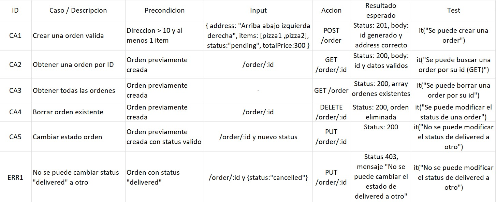
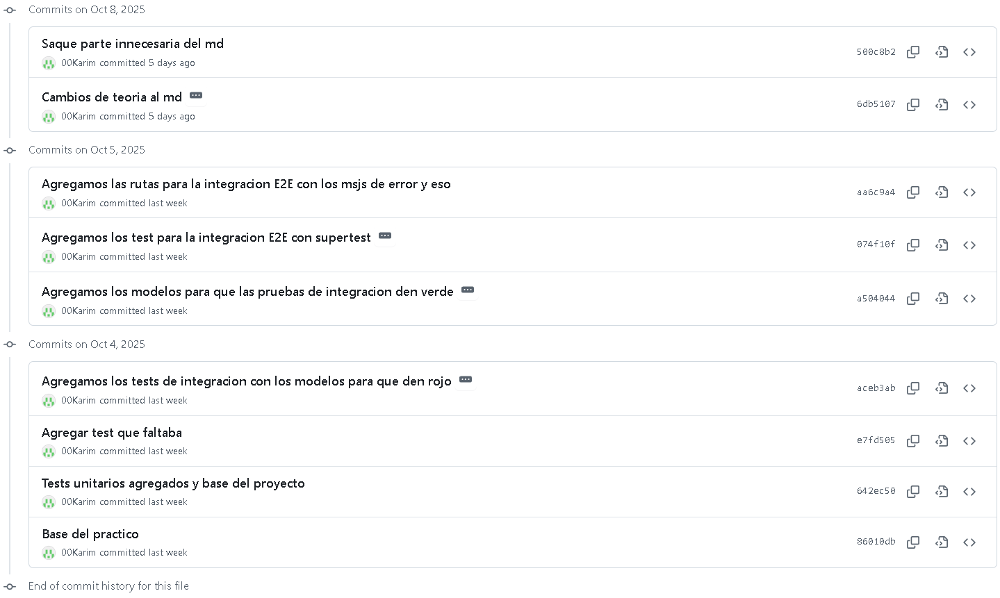

# PRACTICO 2

Proyecto con TypeScript + Express + Zod + Jest + Supertest.

## Requisitos

- Node 18+, npm

# Guia de ejecucion

1. Pararse en la carpeta con nombre "Practico 2"
2. Escribir `npm install` en la terminal y presionar enter
3. Escribir `npm run build` en la terminal y presionar enter

# Guida de ejecucion de tests

- Escribir `npm run test` para ejecutar los test
- Escribir `npm run test:dist` para ejecutar solo los test que estan dentro de la carpeta dist
- Escribir `npm run start` para inicializar el servidor y poder usar los [curls](#curls-para-probar-endpoints)

# TDD Evidencia

1 - Escribir tests unitarios (rojo):

2 - Implementar minimo (verde):

2.1 - Despues de agregar test que faltaba de order:

3 - Agregar test de integracion de los modelos(rojo)

4 - Implementar integracion (verde)

5 - Agregar test integracion E2E con supertest (rojo)

5 - Implementar las rutas para la integracion E2E (verde)

# Matriz de casos

# CURLS para probar endpoints

#### El siguiente curl crea una pizza

curl -X POST http://localhost:3000/pizza \
 -H "Content-Type: application/json" \
 -d '{"size": "S", "toppings": ["Tomate", "Ananá", "Jamón"]}'

#### El siguiente curl crea una order

curl -X POST http://localhost:3000/order \
 -H "Content-Type: application/json" \
 -d '{"address": "Av. Siempreviva 123", "items": [{"size": "M", "toppings": ["Ananá"]}], "status": "pending", "totalPrice": 2500}'

#### El siguiente curl devuelve la orden creada anteriormente

curl -X GET http://localhost:3000/order/0

#### El siguiente curl cambia el estado de la orden creada anteriormente a "delivered"

curl -X PUT http://localhost:3000/order/0 \
 -H "Content-Type: application/json" \
 -d '{"status": "delivered"}'

#### El siguiente curl borra la orden creada anteriormente

curl -X DELETE http://localhost:3000/order/0

# COMMITS evidenciando TDD

