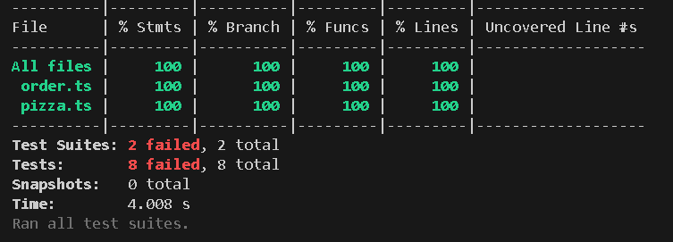
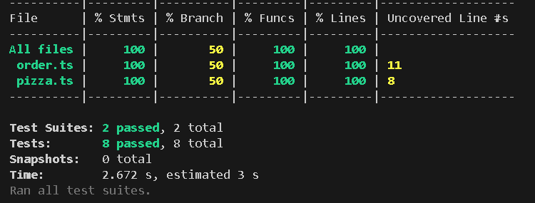
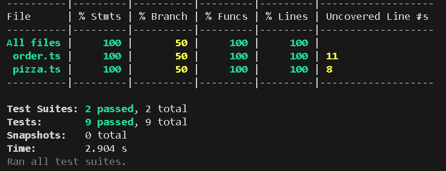
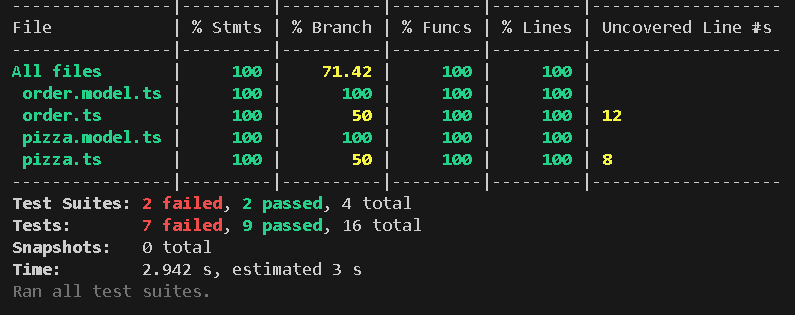
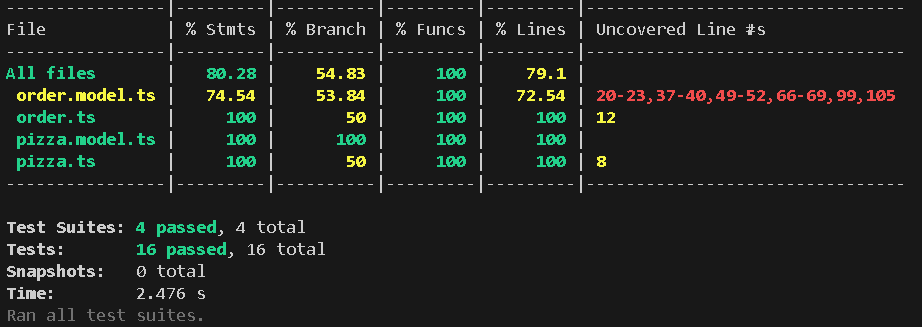
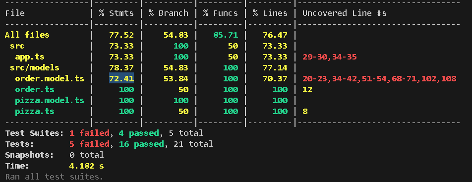
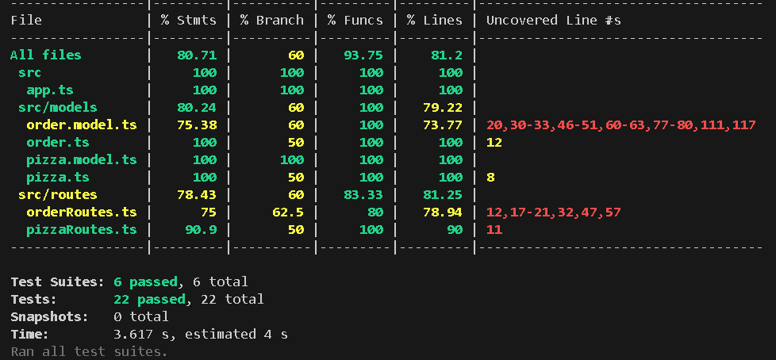

# PRACTICO 2 
Proyecto con TypeScript + Express + Zod + Jest + Supertest.

# TDD Evidencia
1 - Escribir tests unitarios (rojo):

2 - Implementar minimo (verde):

2.1 - Despues de agregar test que faltaba de order:

3 - Agregar test de integracion de los modelos(rojo)

4 - Implementar integracion (verde)
 

5 - Agregar test integracion E2E con supertest (rojo)

5 - Implementar las rutas para la integracion E2E (verde)

# Matriz de casos

# Guia de ejecucion